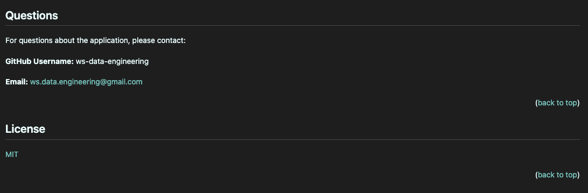

<a id="readme-top"></a>

<!-- PROJECT TITLE -->
# <a id="title"></a>ReadMe Generator #

[](https://opensource.org/licenses/MIT)

<!-- PROJECT DESCRIPTION -->
## <a id="description"></a>Description ##

This Node utility application creates a README file for your next project.

This project contains:


<!-- URL for markdown badges : https://github.com/Ileriayo/markdown-badges -->

<!-- TABLE OF CONTENTS -->
## Table of Contents

- [Description](#description)
- [Installation](#installation)
- [Usage](#usage)
- [Tests](#tests)
- [Contributing](#contributing)
- [Questions](#questions)
- [License](#license)

<!--- INSTALLATION INSTRUCTIONS -->
## <a id="installation"></a>Installation ##

1. Clone the repository.

```bash
git clone https://github.com/your_username_/Project-Name.git
```
2. Install NPM packages 

```bash
npm install
```

<p align="right">(<a href="#readme-top">back to top</a>)</p>

<!-- PROJECT USAGE -->
## <a id="usage"></a>Usage ##

1. Run the index.js main application file:

```bash
node index.js
```

2. Enter answers to the questions in the terminal. 

```bash
? What is your project title? 
? Enter a description 
? What are the installation steps required for your project? 
? Provide instructions for proper usage 
? What are the guidelines for contributing to the project repository? 
? Provide the instructions for testing the application 
? Add your GitHub username 
? Enter your email address 
```

3. Select your license type. Use arrow keys to highlight the license and enter to complete the prompts.

```bash
? What are the licensing requirements for the project? 
  apache 
  bsd_2 
  bsd_3 
❯ mit 
  mozilla 
  attribution 
  none 
```  
**Note:** Selecting a license type will include the associated badge to the top of the README file. Additionally, a licensing section will be added to the bottom of the page with a link to the pertaining website. Example:



*Selecting 'none' from the licensing requirements will omit the license section and badge.

<p align="right">(<a href="#readme-top">back to top</a>)</p>

<!-- TESTING REQUIREMENTS -->
## <a id="tests"></a>Tests ##

Debugging information for Visual Studio Code 1.10+

- In the Debug panel, click the settings icon to open .vscode/launch.json. Select "Node.js" for initial setup.
- See https://github.com/microsoft/vscode for more information.
- Learn more about debugging Node.js: https://nodejs.org/en/learn/getting-started/debugging

<p align="right">(<a href="#readme-top">back to top</a>)</p>

<!-- CONTRIBUTIONS -->
## <a id="contributing"></a>Contributing ##

For suggestions regarding this application, please fork the repository and create a pull request. 

1. Fork the project. Instructions here: https://docs.github.com/en/pull-requests/collaborating-with-pull-requests/working-with-forks/fork-a-repo
2. Create a feature branch: `git checkout -b feature/<branch-name>`
3. Commit the changes: `git commit -m "<commit-message>"`
4. Push to the branch: `git push origin feature/<branch-name>`
5. Open a pull request.

**Option:** Open an issue and tag "enhancement"

Don't forget to give the project a star!

<p align="right">(<a href="#readme-top">back to top</a>)</p>

<!-- CONTACT/QUESTIONS -->
## <a id="questions"></a>Questions ##

For questions about the application, please contact:

**GitHub Username:** ws-data-engineering

**Email:** ws.data.engineering@gmail.com

<p align="right">(<a href="#readme-top">back to top</a>)</p>

<!-- LICENSE INFORMATION -->
## <a id="license"></a>License ##

<a href="https://opensource.org/licenses/MIT">MIT</a>
<p align="right">(<a href="#readme-top">back to top</a>)</p>